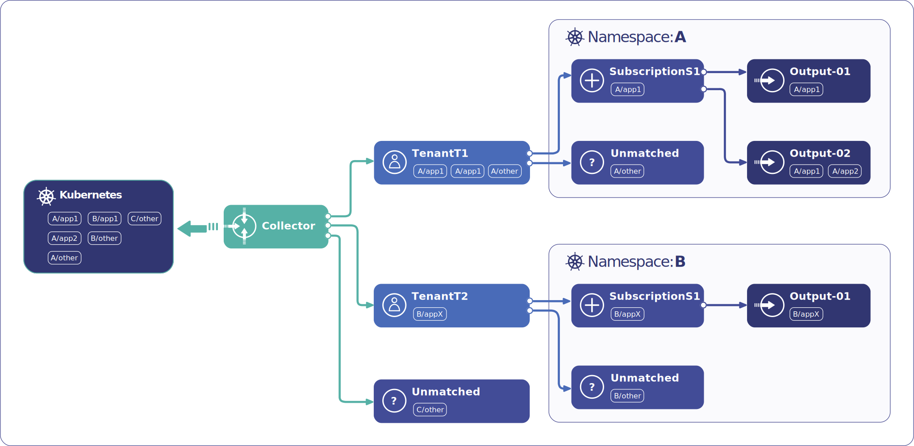
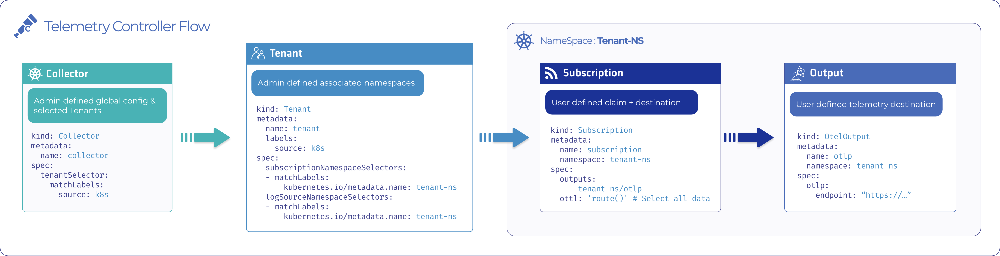

# Telemetry Controller

Telemetry Controller collects, routes, and forwards telemetry data (logs, metrics and traces) from Kubernetes clusters
supporting multi-tenancy out of the box.

The Telemetry Controller provides isolation and access control for telemetry data, similar to what Kubernetes provides for pods, secrets, and other resources. It provides an opinionated, convenient, and robust multi-tenant API on top of OpenTelemetry, and introduces new resources that give granular control over the shared data, while hiding the complexity of setting up and maintaining OpenTelemetry Collector manually.

## Description

Telemetry Controller can be configured using Custom Resources to set up an [opinionated Opentelemetry Collector](#under-the-hood) configuration to route log messages based on rules defined as a Tenant -> Subscription relation map. That way:

- Administrators can define a **collector** and **tenants** to provide isolation and access control for telemetry data. These are cluster scoped resources.
- Users can create **subscriptions** to select telemetry data streams that only their tenant can access.
- Users can create or refer the available **outputs** in their **subscriptions** to route and transport data. That way users can configure what they want to collect and where they want to send it - within their tenant’s scope.



Telemetry Controller can collect container logs that come from stdout/stderr and are written to the host filesystem by the container runtime.

### Collector

Collectors specify global settings for the OTEL Collector DaemonSet, and a `tenantSelector` that lists the Tenants that the collector should pick up. The collector also attaches metadata to the telemetry data sources: for Kubernetes logs, it fetches additional metadata like pod labels and adds those as attributes to log records.

### Tenants

Typically, a tenant is a set of Kubernetes namespaces, which is a best practice for managing multi-tenant workloads inside a single cluster. Tenant resources specify:

- `subscriptionNamespaceSelectors` for namespaces that select subscriptions created by the tenant users, and
- `logSourceNamespaceSelectors` that specify the namespaces where the logs are produced (that are also the concern of the tenant users).

In trivial use cases these two label selectors are the same.

The Tenant is actually a routing rule that helps to make sure that telemetry data is only accessible to a given Subscription if it matches the policies set by the administrator.

### Subscriptions

Tenant users can define their Subscriptions in the namespace(s) of their Tenants. Subscriptions can select from the telemetry data (that is already filtered as part of the Tenant definition) and set Output endpoints where the data is forwarded. Such an endpoint can be:

- an aggregator, for example, [Logging operator](https://kube-logging.dev/),
- a remote telemetry backend, for example, Loki, Jaeger, or Prometheus, or
- a managed service provider, for example, Splunk or Sumo Logic.



## Getting Started

To get started with the Telemetry Controller, complete the following steps. Alternatively, see our [Telemetry Controller overview and quickstart blog post](https://axoflow.com/reinvent-kubernetes-logging-with-telemetry-controller/).

### Prerequisites

- go version v1.22+
- docker version 24+
- kubectl version v1.26+
- kubernetes v1.26+ with *containerd* as the container runtime

### Optional: create a cluster locally

We recommend using kind or minikube for local experimentation and development.

Kind uses containerd by default, but for minikube you have to start the cluster using the `--container-runtime=containerd` flag.

```sh
kind create cluster
# or
minikube start --container-runtime=containerd
```

### Deployment steps for users

Deploy latest telemetry-controller:

```sh
# Install telemetry-controller, and opentelemetry-operator as a sub-chart
helm upgrade --install --wait --create-namespace --namespace telemetry-controller-system telemetry-controller oci://ghcr.io/kube-logging/helm-charts/telemetry-controller
```

### Deployment steps for devs

#### Install deps, CRDs and RBAC

```sh
# Install dependencies (opentelemtry-operator):
make install-deps

# Install the CRDs and RBAC into the cluster:
make install
```

#### Run

```sh
# Option 1 (faster): Run the operator from you local machine (uses cluster-admin rights)
make run

# Option 2 (safer): Build and run the operator inside the cluster (uses proper RBAC)
make docker-build IMG=telemetry-controller:latest

kind load docker-image telemetry-controller:latest
# or
minikube image load telemetry-controller:latest

make deploy IMG=telemetry-controller:latest
```

### Example setup

You can deploy the example configuration provided as part of the docs. This will deploy a demo pipeline with one tenant, two subscriptions, and an OpenObserve instance.
Deploying OpenObserve is an optional, but recommended step, logs can be forwarded to any OTLP endpoint. OpenObserve provides a UI to visualize the ingested logstream.

```sh
# Deploy OpenObserve
kubectl apply -f docs/examples/simple-demo/openobserve.yaml

# Set up portforwarding for OpenObserve UI
kubectl -n openobserve port-forward svc/openobserve 5080:5080 &
```

Open the UI at `localhost:5080`, navigate to the `Ingestion/OTEL Collector` tab, and copy the authorization token as seen on the screenshot.


Paste this token to the example manifests:

```sh
sed -i '' -e "s/\<TOKEN\>/INSERT YOUR COPIED TOKEN HERE/" docs/examples/simple-demo/one_tenant_two_subscriptions.yaml
```

```sh
# Deploy the pipeline definition
kubectl apply -f docs/examples/simple-demo/one_tenant_two_subscriptions.yaml
```

Create a workload, which will generate logs for the pipeline:

```sh
helm install --wait --create-namespace --namespace example-tenant-ns --generate-name oci://ghcr.io/kube-logging/helm-charts/log-generator
```

Open the OpenObserve UI and inspect the generated log messages:

Set up portforwarding for OpenObserve UI

```sh
kubectl -n openobserve port-forward svc/openobserve 5080:5080
```


### Sending logs to logging-operator (example)

(For a more detailed description see our [Sending data to the Logging Operator](https://axoflow.com/kubernetes-logging-telemetry-controller-logging-operator/) blog post.)

Install dependencies (cert-manager and opentelemetry-operator):

```sh
kubectl apply -f https://github.com/cert-manager/cert-manager/releases/download/v1.14.4/cert-manager.yaml
```

```sh
kubectl apply -f https://github.com/open-telemetry/opentelemetry-operator/releases/download/v0.112.0/opentelemetry-operator.yaml
# Wait for the opentelemtry-operator to be running
kubectl wait --namespace opentelemetry-operator-system --for=condition=available deployment/opentelemetry-operator-controller-manager --timeout=300s
```

Deploy latest telemetry-controller:

```sh
kubectl apply -k github.com/kube-logging/telemetry-controller/config/default --server-side
```

Install logging-operator

```sh
helm upgrade --install logging-operator oci://ghcr.io/kube-logging/helm-charts/logging-operator --version=4.6.0 -n logging-operator --create-namespace
```

Install log-generator

```sh
helm upgrade --install --wait log-generator oci://ghcr.io/kube-logging/helm-charts/log-generator -n log-generator --create-namespace
```

Apply the provided example resource for logging-operator: [logging-operator.yaml](./docs/examples/fluent-forward/logging-operator.yaml)

```sh
kubectl apply -f logging-operator.yaml
```

Apply the provided example resource for telemetry-controller: [telemetry-controller.yaml](./docs/examples/fluent-forward/telemetry-controller.yaml)

```sh
kubectl apply -f telemetry-controller.yaml
```

## Under the hood

Telemetry Controller uses a [custom OpenTelemetry Collector distribution](https://github.com/axoflow/axoflow-otel-collector-releases) as its agent. This distribution is and will be compatible with the upstream OpenTelemetry Collector distribution regarding core features, but:

- We reduce the footprint of the final image by removing unnecessary components. This reduces not just the size, but also the vulnerability surface of the collector.
- We include additional components with features not available in the upstream OpenTelemetry Collector, for example, to provide a richer set of metrics.
- We use the OpenTelemetry Operator as the primary controller to implicitly manage the collector.

OpenTelemetry Collector runs as a DaemonSet, mounting and reading the container log files present on the node. During the initial parsing of the log entries, we extract the pod name, pod namespace, and some other metadata. This allows us to associate the log entry to the respective source pod through the Kubernetes API, and to fetch metadata which cannot be extracted from the message alone.

## Support

If you encounter problems while using the Telemetry Controller, [open an issue](https://github.com/kube-logging/telemetry-controller/issues) or talk to us on the [#logging-operator Discord channel](https://discord.gg/eAcqmAVU2u).

## Further info

For further information, use cases, and tutorials, read our [blog posts about Telemetry Controller](https://axoflow.com/tag/telemetry-controller/), for example:

- [Introduction and getting started with Telemetry Controller](https://axoflow.com/reinvent-kubernetes-logging-with-telemetry-controller/)
- [How to send Kubernetes logs to Loki](https://axoflow.com/send-kubernetes-logs-to-loki-with-telemetry-controller/)
- [Sending data to the Logging Operator](https://axoflow.com/kubernetes-logging-telemetry-controller-logging-operator/)

We also give talks about Telemetry Controller at various open source conferences, for example, at Open Source Summit Europe 2024:

<iframe width="560" height="315" src="https://www.youtube.com/embed/vz2chMIzrgs?si=k4ZHbp4AWzkj3Niv" title="YouTube video player" frameborder="0" allow="accelerometer; autoplay; clipboard-write; encrypted-media; gyroscope; picture-in-picture; web-share" referrerpolicy="strict-origin-when-cross-origin" allowfullscreen></iframe>

## Contributing

If you find this project useful, help us:

- Support the development of this project and star this repo! :star:
- Help new users with issues they may encounter :muscle:
- Send a pull request with your new features and bug fixes :rocket:

Please read the [Organisation's Code of Conduct](https://github.com/kube-logging/.github/blob/main/CODE_OF_CONDUCT.md)!

*For more information, read our organization's [contribution guidelines](https://github.com/kube-logging/.github/blob/main/CONTRIBUTING.md)*.

## License

The project is licensed under the [Apache 2.0 License](LICENSE).
